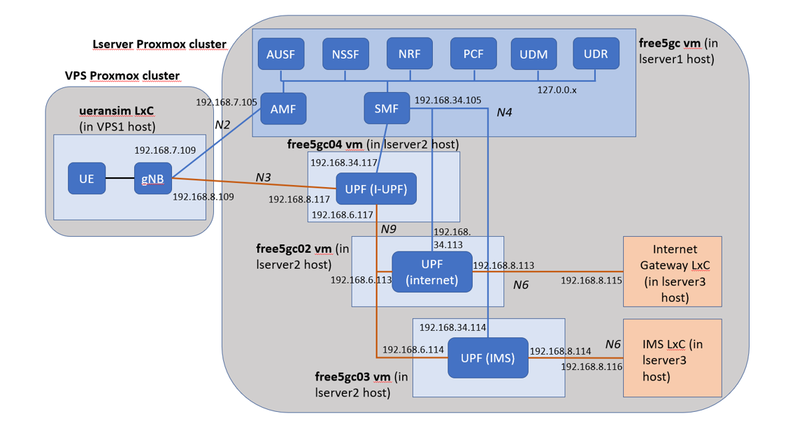
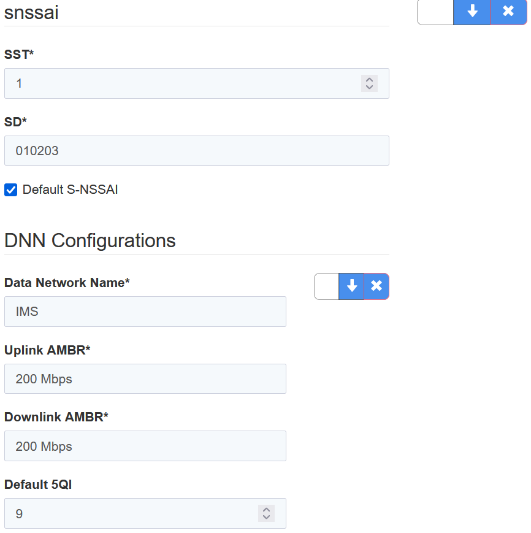

# Multiple UPF PoC

The objective of this PoC is demonstrating the following 5G functionalities using the Free5GC implementation:
-	Split of user and control plane functions in different VMs and physical hosts. It demonstrates the possibility of using dedicated resources to each type of traffic.
-	Definition of one I-UPF to act as an Uplink Classifier. 
-	Alignment of UERANSIM, UDM and SMF configuration to enable two Data Networks: Internet and IMS. The uplink classifier will address different UPFs to connect with each DN.
-	Split of access and 5GC in different environments interconnected via the VXLAN overlay network.
The overall concept is described in the next diagram:

</img>

## Detail of resources deployed in the test bench to enable this configuration
-	First Free5GC VM: It runs all 5GC nodes, except UPF, to handle all control plane functions.
-	Second Free5GC VM: instance containing UPF that handles Internet DN.
-	Third Free5GC VM: instance containing UPF that handles IMS DN.
-	Fourth Free5GC VM: It runs the I-UPF acting as Uplink Classifier. It connects the user plane with UERANSIM gNB in one side, and Internet or IMS dedicated UPFs, depending on the DN traffic.

## Additional elements required to build the PoC
-	UERANSIM LxC instance to simulate the access network (gNB) and UE.
-	LxC instance to simulate the Internet Gateway function (simple Linux VM)
-	LxC instance to simulate the IMS node (simple Linux VM)
Distribution of elements in Poxmox local and VPS clusters’ test bench:
	- UERANSIM in VPS1 physical node (VPS cluster)
	- Free5GC - control plane: lserver1 physical node (local cluster)
	- Free5GC - UPFs: lserver2 physical node (local cluster)
	- LxCs internet gateway y IMS, lserver3 physical node (local cluster)
  
## Low-level details of configuration applied:
- First Free5GC VM:
	- Update of ./free5gc/config/amfcfg.yaml for AMF configuration, setting the N2 interface in ngapIpList element and Internet and IMS DNNs in supportDnnList element (complete file in https://github.com/chemadh/5GC_PoCs/tree/main/Free5GC_PoCs/Multiple_UPF/config_files/free5gc/amfcfg.yaml)

```
  ngapIpList:  # the IP list of N2 interfaces on this AMF
    - 192.168.7.105  # 127.0.0.1
 
  supportDnnList:  # the DNN (Data Network Name) list supported by this AMF
    - internet
    - IMS
```
```
```


	- Update of ./free5gc/config/smfcfg.yaml for SMF configuration, setting the following (complete file in https://github.com/chemadh/5GC_PoCs/tree/main/Free5GC_PoCs/Multiple_UPF/config_files/free5gc/smfcfg.yaml):
		- IMS and Internet DNN in dnnInfos section of sNssai defined in snssaiInfos section, where supported S-NSSAIs are defined.
```
  snssaiInfos: # the S-NSSAI (Single Network Slice Selection Assistance Information) list supported by t>
    - sNssai: # S-NSSAI (Single Network Slice Selection Assistance Information)
        sst: 1 # Slice/Service Type (uinteger, range: 0~255)
        sd: 010203 # Slice Differentiator (3 bytes hex string, range: 000000~FFFFFF)
      dnnInfos: # DNN information list
        - dnn: internet # Data Network Name
          dns: # the IP address of DNS
            ipv4: 8.8.8.8
        - dnn: IMS # Data Network Name
          dns: # the IP address of DNS
            ipv4: 8.8.8.8
```

		- N4 interface definition in pfcp section:
```
  pfcp: # the IP address of N4 interface on this SMF (PFCP)
    addr: 192.168.34.105 # 127.0.0.1
```
		- Definition of UPF-I, UPF-Internet and UPF-IMS associations in up_nodes element of userplane_information section.
```
  userplane_information: # list of userplane information
    up_nodes: # information of userplane node (AN or UPF)
      gNB1: # the name of the node
        type: AN # the type of the node (AN or UPF)
      UPF_I:  # the name of the node
        type: UPF # the type of the node (AN or UPF)
        node_id: 192.168.34.117 # 127.0.0.8 # the IP/FQDN of N4 interface on this UPF (PFCP)
        sNssaiUpfInfos: # S-NSSAI information list for this UPF
          - sNssai: # S-NSSAI (Single Network Slice Selection Assistance Information)
              sst: 1 # Slice/Service Type (uinteger, range: 0~255)
              sd: 010203 # Slice Differentiator (3 bytes hex string, range: 000000~FFFFFF)
            dnnUpfInfoList: # DNN information list for this S-NSSAI
              - dnn: internet
              - dnn: IMS
        interfaces: # Interface list for this UPF
          - interfaceType: N3 # the type of the interface (N3 or N9)
            endpoints: # the IP address of this N3/N9 interface on this UPF
              - 192.168.8.117  # 127.0.0.8
            networkInstance: internet # Data Network Name (DNN)
          - interfaceType: N3 # the type of the interface (N3 or N9)
            endpoints: # the IP address of this N3/N9 interface on this UPF
              - 192.168.8.117  # 127.0.0.8
            networkInstance: IMS # Data Network Name (DNN)
          - interfaceType: N9 # the type of the interface (N3 or N9)
            endpoints: # the IP address of this N3/N9 interface on this UPF
              - 192.168.6.117  # 127.0.0.8
            networkInstance: internet # Data Network Name (DNN)
          - interfaceType: N9 # the type of the interface (N3 or N9)
            endpoints: # the IP address of this N3/N9 interface on this UPF
              - 192.168.6.117  # 127.0.0.8
            networkInstance: IMS # Data Network Name (DNN)
      UPF_Internet:  # the name of the node
        type: UPF # the type of the node (AN or UPF)
        node_id: 192.168.34.113 # 127.0.0.8 # the IP/FQDN of N4 interface on this UPF (PFCP)
        sNssaiUpfInfos: # S-NSSAI information list for this UPF
          - sNssai: # S-NSSAI (Single Network Slice Selection Assistance Information)
              sst: 1 # Slice/Service Type (uinteger, range: 0~255)
              sd: 010203 # Slice Differentiator (3 bytes hex string, range: 000000~FFFFFF)
            dnnUpfInfoList: # DNN information list for this S-NSSAI
              - dnn: internet
                pools:
                  - cidr: 60.60.0.0/24 # 60.60.0.0/24
        interfaces: # Interface list for this UPF
          - interfaceType: N9 # the type of the interface (N3 or N9)
            endpoints: # the IP address of this N3/N9 interface on this UPF
              - 192.168.6.113  # 127.0.0.8
            networkInstance: internet # Data Network Name (DNN)
      UPF_IMS:  # the name of the node
        type: UPF # the type of the node (AN or UPF)
        node_id: 192.168.34.114 # 127.0.0.8 # the IP/FQDN of N4 interface on this UPF (PFCP)
        sNssaiUpfInfos: # S-NSSAI information list for this UPF
          - sNssai: # S-NSSAI (Single Network Slice Selection Assistance Information)
              sst: 1 # Slice/Service Type (uinteger, range: 0~255)
              sd: 010203 # Slice Differentiator (3 bytes hex string, range: 000000~FFFFFF)
            dnnUpfInfoList: # DNN information list for this S-NSSAI
              - dnn: IMS
                pools:
                  - cidr: 60.60.1.0/24 # 60.60.1.0/24
        interfaces: # Interface list for this UPF
          - interfaceType: N9 # the type of the interface (N3 or N9)
            endpoints: # the IP address of this N3/N9 interface on this UPF
              - 192.168.6.114  # 127.0.0.8
            networkInstance: IMS # Data Network Name (DNN)
 
```
		- Definition of user plane topology in links section.
```
    links: # the topology graph of userplane, A and B represent the two nodes of each link
      - A: gNB1
        B: UPF_I
      - A: UPF_I
        B: UPF_Internet
      - A: UPF_I
        B: UPF_IMS
```
	- Update ./free5gc/config/uerouting.yaml to identify routing details related to UEs, where the user plane topology defined in SMF config is replicated and associated to UEs to be used in the test (complete file in https://github.com/chemadh/5GC_PoCs/tree/main/Free5GC_PoCs/Multiple_UPF/config_files/free5gc/uerouting.yaml).
```
ueRoutingInfo: # the list of UE routing information
  UE1: # Group Name
    members:
    - imsi-208930000000003 # Subscription Permanent Identifier of the UE
    topology: # Network topology for this group (Uplink: A->B, Downlink: B->A)
    # default path derived from this topology
    # node name should be consistent with smfcfg.yaml
      - A: gNB1
        B: UPF_I
      - A: UPF_I
        B: UPF_Internet
      - A: UPF_I
        B: UPF_IMS
    specificPath:
      - dest: 192.168.8.115/32 # the destination IP address on Data Network (DN)
        # the order of UPF nodes in this path. We use the UPF's name to represent each UPF node.
        # The UPF's name should be consistent with smfcfg.yaml
        path: [UPF_I, UPF_Internet]
      - dest: 192.168.8.116/32 # the destination IP address on Data Network (DN)
        # the order of UPF nodes in this path. We use the UPF's name to represent each UPF node.
        # The UPF's name should be consistent with smfcfg.yaml
        path: [UPF_I, UPF_IMS]
```
- Second Free5GC VM:
		- Update of ./free5gc/NFs/upf/build/config/upfcfg.yaml for UPF configuration, setting pfcp and gtpu addresses in their relative sections. Definition of Internet and IMS in dnn_list section (complete file in https://github.com/chemadh/5GC_PoCs/tree/main/Free5GC_PoCs/Multiple_UPF/config_files/free5gc02/upfcfg.yaml).
```
  # The IP list of the N4 interface on this UPF (Can't set to 0.0.0.0)
  pfcp:
    - addr: 192.168.34.113 # 127.0.0.8

  # The IP list of the N3/N9 interfaces on this UPF
  # If there are multiple connection, set addr to 0.0.0.0 or list all the addresses
  gtpu:
    - addr: 192.168.6.113  # 127.0.0.8

  dnn_list:
    - dnn: internet # Data Network Name
      cidr: 60.60.0.0/24 # 60.60.2.0/24 # Classless Inter-Domain Routing for assigned IPv4 pool of UE
```
- Third Free5GC VM:
	- Update of ./free5gc/NFs/upf/build/config/upfcfg.yaml for UPF configuration, setting pfcp and gtpu addresses in its respective sections. Definition of IMS in dnn_list section (complete file in https://github.com/chemadh/5GC_PoCs/tree/main/Free5GC_PoCs/Multiple_UPF/config_files/free5gc03/upfcfg.yaml).
```
  # The IP list of the N4 interface on this UPF (Can't set to 0.0.0.0)
  pfcp:
    - addr: 192.168.34.117 # 127.0.0.8

  # If there are multiple connection, set addr to 0.0.0.0 or list all the addresses
  gtpu:
    - addr: 192.168.8.117  # 127.0.0.8
    - addr: 192.168.6.117  # 127.0.0.8


  # The DNN list supported by UPF
  dnn_list:
    - dnn: internet # Data Network Name
    - dnn: IMS # Data Network Name
```
- Fourth Free5GC VM:
	- Update of ./free5gc/NFs/upf/build/config/upfcfg.yaml for UPF configuration, setting pfcp and gtpu addresses in its respective sections. Definition of IMS and Internet in dnn_list section (complete file in https://github.com/chemadh/5GC_PoCs/tree/main/Free5GC_PoCs/Multiple_UPF/config_files/free5gc04/upfcfg.yaml).
```
  # The IP list of the N4 interface on this UPF (Can't set to 0.0.0.0)
  pfcp:
    - addr: 192.168.34.117 # 127.0.0.8

  # If there are multiple connection, set addr to 0.0.0.0 or list all the addresses
  gtpu:
    - addr: 192.168.8.117  # 127.0.0.8
    - addr: 192.168.6.117  # 127.0.0.8


  # The DNN list supported by UPF
  dnn_list:
    - dnn: internet # Data Network Name
    - dnn: IMS # Data Network Name
```
- Global reconfiguration of startup script in each Free5G VM (run.sh):
	- For VMs running only UPF, removal of parts of the script dedicated to launch the rest of 5GC elements (complete file in https://github.com/chemadh/5GC_PoCs/tree/main/Free5GC_PoCs/Multiple_UPF/config_files/free5gc02/run_only_upf.sh).
	- For VM running only the control plane, removal of parts of the script dedicated to launch the UPF. (complete file in https://github.com/chemadh/5GC_PoCs/tree/main/Free5GC_PoCs/Multiple_UPF/config_files/free5gc/run.sh).
- Update of 5GC subscription information (UDM web UI): Update of one of the UEs to define two DNNs: Internet and IMS. A capture of the resulting change in the web UI can be seen below:

</img>

- Update of UERANSIM: 
	- Update of gNB configuration file to configure N2 NGAP interface to interact with AMF LAN IP (complete file in https://github.com/chemadh/5GC_PoCs/tree/main/Free5GC_PoCs/Multiple_UPF/config_files/ueransim/free5gc-gnb.sh).
	- Update of UE configuration file to define both Internet and IMS DNNs (complete file in https://github.com/chemadh/5GC_PoCs/tree/main/Free5GC_PoCs/Multiple_UPF/config_files/ueransim/free5gc-ue.sh).

## Tests done:
Once all Free5GC and UERANSIM components are running (using their respectively updated run.sh and run_only_upf.sh startup scripts), it can be checked that UERANSIM node has raised two GTP tunnels with I-UPF, one for Internet DNN and other for IMS DNN. UERANSIM startup example:
```
cd UERANSIM
build/nr-gnb -c config/free5gc-gnb.yaml
sudo build/nr-ue -c config/free5gc-ue.yaml
```
Connectivity tests (i.e. ping with tcpdump traffic validation) can be done to verify that:
-	Traffic connecting with Internet Gateway and using GTP interface associated to Internet DNN in UE, follows the user plane path gNB – i-UPF – Internet UPF – Internet Gateway LxC. Example ping command:
```
sudo ping 192.168.8.115 -I uesimtun0
```
-	Traffic connecting with IMS node and using GTP interface associated to IMS DNN in UE, follows the user plane path gNB – i-UPF – IMS UPF – IMS LxC. Example ping command:
```
sudo ping 192.168.8.116 -I uesimtun1
```
Note: please follow all the environment preparation instructions described in Free5GC basic setup guides: enable ip forwarding, setup NAT for traffic plane interfaces and stop firewall:
```
sudo sysctl -w net.ipv4.ip_forward=1
sudo iptables -t nat -A POSTROUTING -o ens18 -j MASQUERADE
sudo iptables -I FORWARD 1 -j ACCEPT
sudo iptables -I INPUT -i upfgtp -j ACCEPT
sudo systemctl stop ufw
```
## Possible further improvements:
In addition to the present PoC definition, the following improvements that can be identified for further activities (out of the scope of the present Master Thesis):
1.	Deployment of Kamailo IMS (included since Kamailio 4.0) in IMS LxC instance.
2.	Deployment of a second URANSIM with an additional UE, using also both Internet and IMS DNs. 
3.	Configuration of a SIP phone in each UERANSIM LxC instance, to register two users in Kamailio IMS once the UEs are registered and IMS data session are set up.
4.	Call example between the two UEs. 
