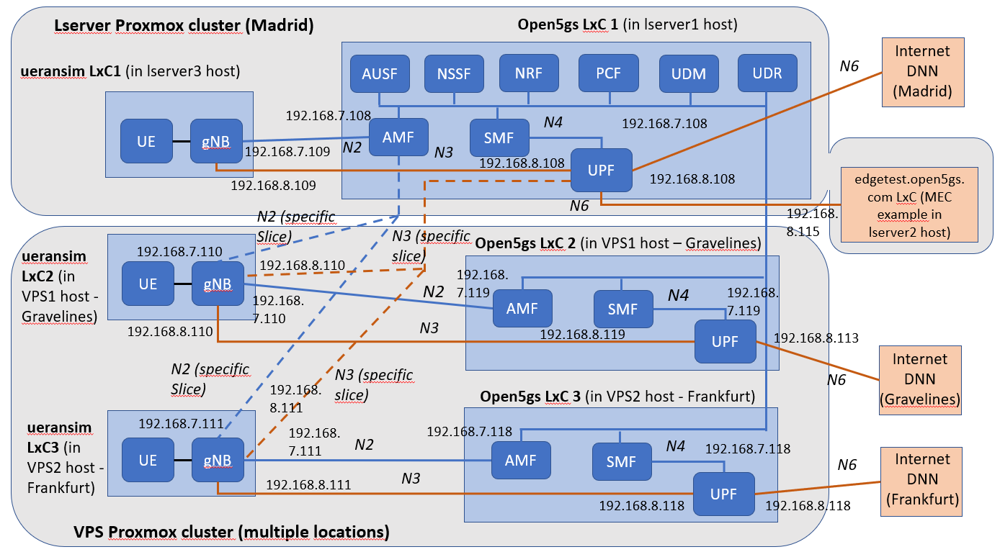

# Open5GS - Network slicing, edge computing

The objective of this PoC is demonstrating network slicing and edge computing functionalities using the Open5GS implementation. In order to achieve this, the following setup is deployed in the test workbench:
-	Three instances of Open5GS core in two Proxmox clusters (Local and VPS), and three different locations (Madrid -Spain-, Gravelines -France- and Frankfurt -Germany-).
    - First Open5GS instance in Madrid (LxC in Lserver1 Proxmox host), containing all 5GC components.
    - Second Open5GS instance in Gravelines (LxC in VPS1 Proxmox host), containing UPF, SMF and AMF.
    - Third Open5GS instance in Frankfurt (LxC in VPS2 Proxmox host), containing UPF, SMF and AMF.
- Three UERANSIM instances, in the same three environments where Open5GS deployments are available.
- One LxC instance containing an example web server, to be associated to MEC/Edge computing service. It is deployed in Local Proxmox Lserver2 host, and configured to serve the FQDN edgetest.open5gs.com.

This environment is used to demonstrate the following concepts:
-	Each UE in UERANSIM instance available, using the default slice NSSAI and Internet DNN, connects with its local AMF and SMF, and enables the local GTP user plane with the local UPF to reach Internet DNN locally, with the minimum latency possible. It is also enabled by configuring different TACs in each location (in both UERANSIM’s gNB and AMFs).
-	There will be also an alternative slice NSSAI available for UERANSIM instances and Open5GS instance in Madrid. It will enable that UEs using this alternative NSSAI will be served by Madrid Open5GS core network instance, enabling also a local resolution of edgetest.open5gs.com address, that is associated to the local LxC instance where the MEC/Edge example web server is available.

The overall concept is also described in the next diagram:

</img>

## Summary of Open5GS resources used to build the configuration

### PoC still under construction, detailed Open5GS NFs configuration files will be attached once it could be finally completed

The setup is based on the following parametrization:
-	Tracking Area Codes (TACs) distribution: 1 – Madrid, 2 – Gravelines, 3 – Frankfurt.
-	Network Slice associated to MEC example configuration in Madrid NFs and LxCs, using SST (Slice Selection Type) 128.
-	Default SST set to 1.
Based on this, the configuration applied to each node is the following:
-	Configuration of Open5GS LxC in Lserver1 Proxmox cluster node in Madrid:
        - Update of all NFs configuration files to use the LxC VxLAN IPs with unique ports in SBI, NGAP, PFCP, GTP-U and GTP-C interfaces, and selecting the NRF IP and Port in all NFs to allow to register (ausf.yaml, nssf.yaml, nrf.yaml, pcf.yaml, udm.yaml, udr.yaml, amf.yaml, smf.yaml, upf.yaml, mme.yaml)
    - Specific configuration of AMF:
        - Update of TAI (Tracking Area Identifier) information served by the AMF, including TAC (Tracking Area Codes) 1.
        - Update of supported network slices in s_nssai field in plmn_support element, where two sst (Slice Selection Type) are set: 1 (eMBB, by default) and 128 (custom operator slice).
        - Update the amf_name to a unique identifier (since there will be more than one AMF in this deployment).
    - Specific configuration of SMF:
        - Configuration of LxC LAN IP to be used as DNS.
        - Configuration of TAC 1 in TAI field of s_nssai with SST 1, inside info element (by default).
        - Configuration of TACs 1, 2 and 3 in TAI field of a new s_nssai structure with SST 128, inside info element.
        - Configuration of the address of the local LxC UPF in pcfp value of upf element.
    - Specific configuration of subscribers (UDM GUI):
        - Copying SST entry in subscriber to use in the new network slice to generate a new entry for SST 128, with the same DNN Internet and MBR bandwidth limitation values.
- Configuration of MEC example LxC in Lserver2 Proxmox cluster node in Madrid:
    - Apache web server set up, linked with the VxLAN LxC IP.
    - Configuration of MEC example LxC IP resolution in Bind daemon setup in Open5GS LxC in Madrid, associated to edgetest.open5gs.com FQDN.
- Configuration of Open5GS LxC in VPS1 Proxmox cluster node in Gravelines:
    - Update of configuration files related to NFs set up, to use the LxC VxLAN IPs with unique ports in SBI, NGAP, PFCP, GTP-U and GTP-C interfaces, and selecting the NRF IP and Port in all NFs to allow registering (amf.yaml, smf.yaml, upf.yaml). Reconfiguration of service files to only launch AMF, SMF and UPF NFs.
    - Specific configuration of AMF:
        - Update of TAI (Tracking Area Identifier) information served by the AMF, including TAC (Tracking Area Codes) 2
        - Update of supported network slices in s_nssai field in plmn_support element, where two sst (Slice Selection Type) are set: 1 (eMBB, by default) and 128 (custom operator slice).
        - Update the amf_name to a unique identifier (since there will be more than one AMF in this deployment).
    - Specific configuration of SMF:
        - Configuration of TAC 2 in TAI field of s_nssai with SST 1, inside info element (by default).
        - Configuration of the address of the local LxC UPF in pcfp value of upf element.
- Configuration of Open5GS LxC in VPS2 Proxmox cluster node in Frankfurt:
    - Update of configuration files related to NFs set up, to use the LxC VxLAN IPs with unique ports in SBI, NGAP, PFCP, GTP-U and GTP-C interfaces, and selecting the NRF IP and Port in all NFs to allow registering (amf.yaml, smf.yaml, upf.yaml). Reconfiguration of service files to only launch AMF, SMF and UPF NFs.
    - Specific configuration of AMF:
        - Update of TAI (Tracking Area Identifier) information served by the AMF, including TAC (Tracking Area Code) 3
        - Update of supported network slices in s_nssai field in plmn_support element, where two sst (Slice Selection Type) are set: 1 (eMBB, by default) and 128 (custom operator slice).
        - Update the amf_name to a unique identifier (since there will be more than one AMF in this deployment).
    - Specific configuration of SMF:
        - Configuration of TAC 3 in TAI field of s_nssai with SST 1, inside info element (by default).
        - Configuration of the address of the local LxC UPF in pcfp value of upf element.
- Configuration of UERANSIM LxC in Lserver3 Proxmox cluster node in Madrid:
    - Update of gNB configuration file:
        - TAC set 1. 
        - List of supported AMFs is set to include the VxLAN IPs and ports of three instances available.
        - Unique gNB identifier is also set. 
        - Supported slices is updated to include SSTs 1 and 128.
    - Update of UE configuration file:
        - Update of SST to test (1 or 128), in fields sessions, configured_nssai and default_nssai.
    - Update of gNB configuration file:
        - TAC set 2. 
        - List of supported AMFs is set to include the VxLAN IPs and ports of three instances available.
        - Unique gNB identifier is also set. 
        - Supported slices is updated to include SSTs 1 and 128.
    - Update of UE configuration file:
        - Update of SST to test (1 or 128), in fields sessions, configured_nssai and default_nssai.
- Configuration of UERANSIM LxC in VPS2 Proxmox cluster node in Frankfurt:
    - Update of gNB configuration file:
        - TAC set 3. 
        - List of supported AMFs is set to include the VxLAN IPs and ports of three instances available.
        - Unique gNB identifier is also set. 
        - Supported slices is updated to include SSTs 1 and 128.
    - Update of UE configuration file:
        - Update of SST to test (1 or 128), in fields sessions, configured_nssai and default_nssai.

## Tests to be done once the PoC could be completed
- When network slice SST 1 is selected in UERANSIM nodes:
    - The GTP-U tunnel related to Internet DNN is raised using the local AMF, SMF and UPF instances. Check of low network latency when accessing Internet sites close to the UPF server location.
- When network slice SST 128 is selected in UERANSIM nodes:
    - The GTP-U tunnel related to Internet DNN is raised using Madrid AMF, SMF and UPF instances. Edge test node is accessible by connecting with the web server available in edgetest.open5gs.com FQDN. Network latency for this access should be lower when using UERANSIM in Madrid cluster.

